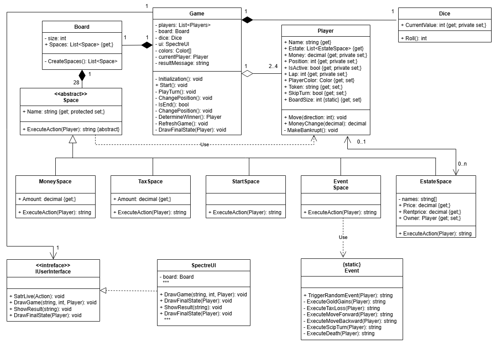

# Monopoly – OOP Konsolenprojekt

Dieses Projekt ist eine vereinfachte digitale Umsetzung des Brettspiels **Monopoly** als Konsolenanwendung in **C#**.

Das Projekt wurde im Rahmen des Moduls **Grundlagen der objektorientierten Programmierung (OOP)** entwickelt. Ziel ist es, zentrale OOP-Konzepte wie **Kapselung, Vererbung und Polymorphie** praktisch anzuwenden.

## Spielfunktionen

- 2–4 Spieler
- Würfeln und Bewegen auf dem Spielfeld
- verschiedene Feldtypen mit unterschiedlichen Aktionen
- Immobilien kaufen und Miete bezahlen
- Geld und Spielstatus der Spieler verwalten
- zufällige Ereignisse
- Spieler können aus dem Spiel ausscheiden
- automatische Ermittlung des Gewinners

## OOP-Konzepte

Das Projekt verwendet unter anderem:

- **Kapselung**
- **Vererbung**
- **Polymorphie**
- **Abstrakte Klassen**
- **Interfaces**
- **Klassenbeziehungen und Multiplizitäten**

Die verschiedenen Spielfelder basieren auf der abstrakten Klasse `Space` und implementieren ihr Verhalten über `ExecuteAction(Player)` polymorph.

## Benutzeroberfläche

Die Anwendung besitzt eine interaktive Konsolenoberfläche mit **Spectre.Console**.  
Das Spielfeld, die Spieler, ihre Positionen, ihr Guthaben und aktuelle Spielaktionen werden während des Spiels übersichtlich dargestellt.

## UML-Klassendiagramm

Das vollständige UML-Klassendiagramm befindet sich im Ordner `docs`.

## Technologien

- C#
- .NET
- Spectre.Console
- Git / GitHub
- UML

## UML Class Diagram

